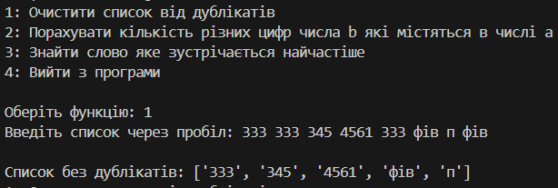
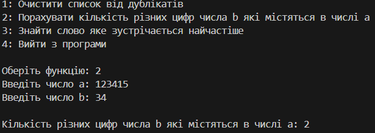
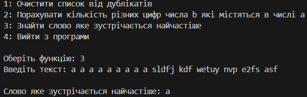

# Control Work — Python Functions

This repository contains solutions to the control work assigned in the **Scripting Programming Languages** course. The work includes the implementation of Python functions for data processing and analysis, including list cleaning, digit comparison, word frequency analysis, and library creation.

## Task Overview

### ✅ Task 1: `clean_list(list_to_clean)`

**Description**:  
This function takes a single argument — a list of arbitrary values (strings, integers, floats) of any length, and returns a list consisting of the same values **without duplicates**. Only the first occurrence of each element is kept.

### Example :

### ✅ Task 2: `counter(a, b)`

**Description**:
This function accepts two non-negative integers a and b, and returns the number of unique digits that are present in b and also appear in a.

### Example :

### ✅ Task 3: `find_most_frequent(text)`

**Description**:
This function takes a string containing text of arbitrary length and returns the word (in lowercase) that appears most frequently in the text. The function should ignore punctuation (e.g., .,:;!?) and whitespace.

### Example :

### ✅ Task 4: Library Creation

**Description**:
Create a Python library/module that includes all the functions described above. This allows reusability and better code organization.

### 📁 Project Structure
**Test_work/**
│
├── main.py
├── Function_lib        
|   ├── __init__.py            
|   └── func.py
               
